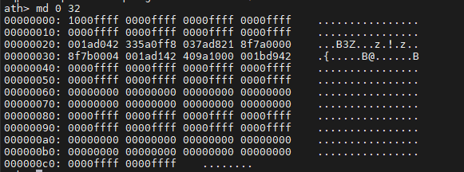
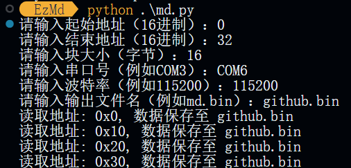
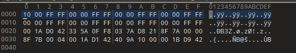

# EzMd
这是一款自动使用md命令提取固件的python脚本
# Tips
请先将设备用`MobaXterm`或其他支持串口连接的软件连接到电脑上，并进入`uboot`模式
再将串口调试工具`关闭!!!`否则会显示`端口占用!!!`
```
Usage:python md.py
```
## 演示
```
md 0 32 #查看内存中0-32地址的数据
```

```
python md.py #运行python脚本
```

```
拖入010Editor查看 提取的数据与md命令提取的数据一致
```
