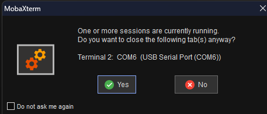
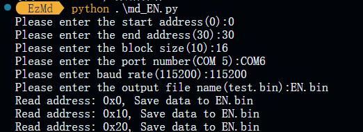
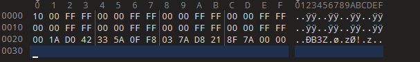

<a herf="./README_EN.md">English</a> | <a herf="./README_ZH.md">中文</a>

# EzMd
This is a Python script that automatically extracts firmware using the md command.
# Tips
Please first connect the device to the computer using `MobaXterm` or any other serial port connection software and enter `uboot` mode.
Then, `close` the `serial debugging tool !!!` Otherwise, it will display `port occupied !!!`

# Clone GitHub project
```
git clone https://github.com/Nop3z/EzMd.git
```

# Install Python library
```
python -r requirements.txt
```
# Usage
```
Usage:python md.py
```
# Demo
```
md 0 32 #View data at addresses 0-32 in memory
```

```
python md_EN.py #Running python scripts
```

```
Drag into 010Editor to view the extracted data, which is consistent with the data extracted by the `md` command.
```

