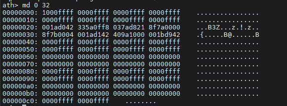
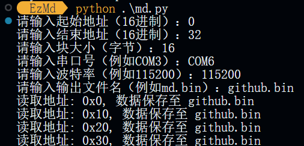
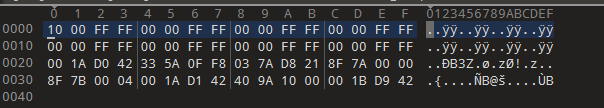

<a herf="./README_EN.md">English</a> | <a herf="./README_ZH.md">中文</a>

# EzMd
这是一款自动使用md命令提取固件的python脚本
# Tips
请先将设备用`MobaXterm`或其他支持串口连接的软件连接到电脑上，并进入`uboot`模式
再将串口调试工具`关闭!!!`否则会显示`端口占用!!!`
# 克隆github项目
```
git clone https://github.com/Nop3z/EzMd.git
```

# 安装python库
```
python -r requirements.txt
```
# 使用方法
```
Usage:python md_ZH.py
```
## 演示
```
md 0 32 #查看内存中0-32地址的数据
```

```
python md_ZH.py #运行python脚本
```

```
拖入010Editor查看 提取的数据与md命令提取的数据一致
```
